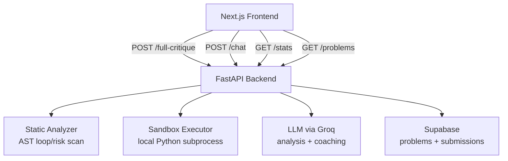

# OpenRank (Agent-Code)

AI-powered competitive programming workspace with code execution, automated critique, coaching chat, and performance analytics.

OpenRank combines a modern coding UI (Next.js + Monaco) with a FastAPI orchestration backend that can:
- execute user code against database-driven test cases,
- run static complexity checks,
- generate AI feedback and strategy coaching,
- and log submissions for trend dashboards.

## Why OpenRank

- **Practice with feedback loops**: write code, run tests, get instant pass/fail and runtime/memory signals.
- **Coach on demand**: request deep AI critique or continue with contextual coaching chat.
- **Track progression**: dashboard summarizes pass rate, dominant coding patterns, and recent activity.
- **Problem-bank driven**: problems, starter code, and test cases are fetched from Supabase.

## Core Features

### Workspace
- Problem picker (`/problems`) with difficulty and full markdown description.
- Monaco editor preloaded with `starter_code`.
- **Run Code** mode (judge only, AI skipped) for fast iteration.
- **Get AI Feedback** mode (judge + LLM analysis + strategy guidance).
- Rich execution panel showing per-case input/expected/actual plus runtime and memory.

### AI Coach
- Structured critique via LLM:
  - time/space complexity,
  - optimality judgment,
  - bug hints,
  - improvement suggestions.
- Strategic coaching:
  - detected pattern,
  - recommended optimal pattern,
  - explanation of tradeoffs,
  - similar practice problems.
- Follow-up conversational coaching with full chat history context.

### Analytics Dashboard
- Total submissions.
- Pass rate.
- Pattern distribution pie chart.
- Recent submissions table (status, complexity, date).

## High-Level Architecture



## Tech Stack

### Frontend
- Next.js 16 (App Router)
- React 18 + TypeScript
- Tailwind CSS
- Monaco Editor (`@monaco-editor/react`)
- Recharts + Lucide icons + React Markdown

### Backend
- FastAPI
- Pydantic
- LangChain + Groq (`llama-3.3-70b-versatile`)
- Supabase Python client
- Local Python sandbox execution using subprocess + tracemalloc

## Repository Structure

```text
backend/
  agent_core.py        # LLM chains, sandbox executor, chat coach
  database.py          # Supabase client + dashboard stats aggregation
  main.py              # FastAPI routes
  schemas.py           # Pydantic output schemas
  static_analyzer.py   # AST complexity/risk scan
  workflow.py          # End-to-end orchestration pipeline
  test_coach.py        # Quick local coaching smoke test
  test_db.py           # Supabase connectivity check

frontend/
  app/page.tsx         # Main product UI (workspace + dashboard)
  app/layout.tsx
  app/globals.css
  package.json
```

## Prerequisites

- **Python** 3.10+
- **Node.js** 18+
- **npm** 9+
- Supabase project with required tables/columns
- Groq API key

## Environment Variables

Create `backend/.env`:

```bash
cp .env.example backend/.env
```

```env
GROQ_API_KEY=your_groq_api_key
SUPABASE_URL=https://YOUR_PROJECT.supabase.co
SUPABASE_KEY=your_supabase_anon_or_service_key
```

> Backend code auto-loads `.env` when variables are not already present.

## Local Setup

### 1) Backend

From `backend/`:

```bash
python -m venv .venv

# Windows
.\.venv\Scripts\activate
# Mac/Linux
source .venv/bin/activate

pip install fastapi uvicorn pydantic langchain-groq langchain-core supabase python-dotenv requests

uvicorn main:app --reload
```

Backend runs at `http://localhost:8000`.

### 2) Frontend

From `frontend/`:

```bash
npm install
npm run dev
```

Frontend runs at `http://localhost:3000`.

## API Reference

Base URL: `http://localhost:8000`

### POST `/full-critique`
Runs the full workflow: static analysis → test execution → optional AI critique.

Request:

```json
{
  "code": "def solution(x): return x",
  "problem": "Two Sum",
  "language": "python",
  "run_ai": true
}
```

Response:

```json
{
  "report": "### Execution & Analysis Summary ...",
  "judge_results": [
    {
      "input": "[2,7,11,15], 9",
      "expected": "[0,1]",
      "actual": "[0, 1]",
      "passed": true,
      "runtime": 1.02,
      "memory": 0.13
    }
  ]
}
```

### POST `/chat`
Continues contextual coaching based on current code + chat history.

Request:

```json
{
  "code": "def solution(...): ...",
  "problem": "Two Sum",
  "history": [
    { "role": "user", "content": "Why is this O(n^2)?" }
  ]
}
```

Response:

```json
{ "reply": "Because your nested loops compare each pair..." }
```

### GET `/stats`
Returns dashboard metrics aggregated from recent submissions.

### GET `/problems`
Returns list for problem dropdown.

### GET `/problems/{problem_id}`
Returns full selected problem payload including description and starter code.

## Supabase Data Model (Expected)

### `problems`
Expected fields used by app:
- `id` (string/uuid)
- `title` (string)
- `difficulty` (string)
- `description` (markdown text)
- `starter_code` (text)
- `test_cases` (JSON array)

Accepted test-case item shape after normalization:

```json
{
  "input": [1, 2],
  "expected_output": 3
}
```

### `submissions`
Fields inserted by workflow logger:
- `problem_name`
- `code_snippet`
- `status` (`PASS` | `FAIL` | `ERROR`)
- `time_complexity`
- `space_complexity`
- `pattern_detected`
- plus table-managed metadata (`id`, `created_at`, etc.)

## Workflow Details

1. **Static scan** parses code AST and estimates loop nesting risk.
2. **Safety gate** can reject high-risk deep nested-loop code paths.
3. **Test resolution** fetches test cases from Supabase by title/description fallback.
4. **Sandbox run** executes function in isolated temp file subprocess with timeout.
5. **Optional AI stage** produces complexity + strategy analysis when `run_ai=true`.
6. **Final report** is generated and submission is logged asynchronously to Supabase.

## Validation & Smoke Tests

From `backend/`:

```bash
python test_db.py      # verifies Supabase connectivity
python test_coach.py   # verifies coaching chain response
```

## Troubleshooting

- **`GROQ_API_KEY is not set`**
  - Ensure `backend/.env` exists and key is valid.
- **`SUPABASE_URL or SUPABASE_KEY is not set`**
  - Add both variables in `backend/.env`.
- **No test cases found for problem**
  - Verify selected problem title/description and `test_cases` data in `problems` table.
- **Frontend cannot reach backend**
  - Confirm FastAPI is running on port `8000`.
- **Next.js warning about multiple lockfiles**
  - Optionally set `turbopack.root` in Next config or remove unrelated lockfiles.

## Security Notes

Current sandbox safety includes basic keyword blocking and timeout controls; it is suitable for local/dev workflows but not hardened for multi-tenant untrusted production execution without stronger isolation.

## Product Roadmap (Suggested)

- Add authentication and per-user data isolation.
- Containerized execution sandbox.
- Multi-language judge support.
- CI checks + automated tests.
- Deployment profiles for staging/production.

## License

This project is licensed under the MIT License. See [LICENSE](LICENSE).
